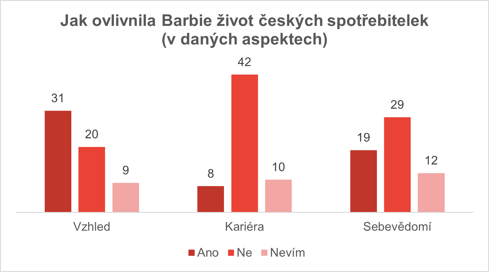
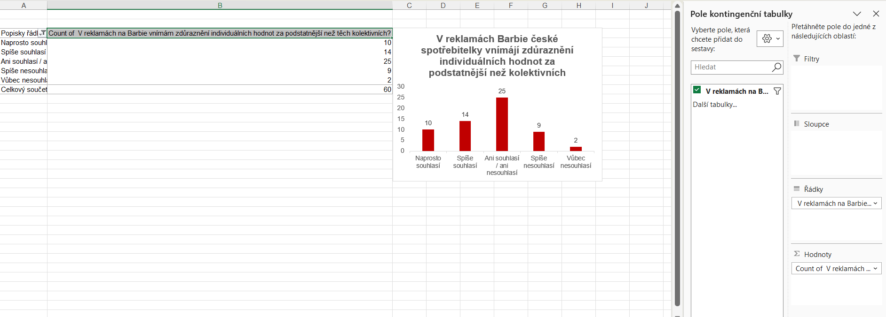

# Barbie_Diploma_Thesis_Excel

## Introduction

The goal of this reseach was to support Barbie brand by better understanding Czech consumers and derive key insights which help to adapt marketing communication of the brand to the local cultural context.

More specifically, the objectives of the thesis were to:

- Identify how Czech female consumers perceive intercultural elements in Barbie advertising.
- Determine whether the Barbie brand influences consumers’ attitudes in Czech Republic.
- Propose appropriate marketing communication strategies for transforming the image of the Barbie brand in the Czech Republic.

## Thesis File

The final version of the diploma thesis is available here: [View Full Thesis](zaverecna_prace.pdf) 

## Tools and Techniques

**Google Forms** were used for data collection: Designed and executed surveys to gather primary data on consumer attitudes.

The following Excel features were used for data preparation and visualization:

- **Data Preparation:** Cleaned, organized and structured raw data for analysis.
- **Pivot Charts:** Used for visualization representation of the collected data.
- **Pivot Tables:** Used for organizing dataset and clearly seeing patterns.

## Dataset Overview (Barbie Survey)

The data were collected using **Google Forms**. The dataset contains both quantitative and qualitative data.

The final dataset consists of **65 responses** from Czech women between the age 19-28.
It contains real-world data, which include information on:

- Demographic characteristics
- Perceptions of gender differences
- Attitudes toward Barbie
- Perception of values and the impact of the Barbie brand
- Views on gender stereotypes in society, media and toys
- Evaluation of the *“Give Limitless Possibilities”* campaign

## Dashboard Development

### Data Preparation

Due to the smaller dataset size, data preparation was performed manually to maintain contextual accuracy and efficiency.  

The preparation process included:

- **Manual data binning:** Categorization of similar responses in quantitative questions. 
- **Text standardization** to improve charts readability (text was in some cases too long for the graphs or had other inconsistensies)
- **Duplicates removal** One respondent conducted the query twice. 
- **Outlier handling** where those extreme "Age" values, which did not match target population, were excluded. (The query answers were reduced from 65 to 60 answers)

###  Charts

**Did Barbie affect you thoughout your life in (look, career, confidence)?**

- **Excel Features:** Combined bar chart feature and optimized layout for clarity.
- **Design Choice:** Horizontal bar chart for visual comparison of how Barbie affects respondents in different areas.
- **Insights Gained:** This enables quick identification of the areas Barbie brand has the biggest influence on, noting there is significant influence on women´s perception of look and confidence, while its influence on career aspirations is limited.

###  Pivot Tables and Pivot Charts

**The findings suggest that in Barbie advertisements, Czech consumers tend to prioritize individual values over collective ones.**

  -  **Pivot Table fields:** Utilizes Pivot Table for specific column of the dataset, where rows are the possible options for the thesis question and for values was for the character of the question more valuable to see count of each option.
- **Pivot Table Purpose:** They are used to summarize and organize data and serve as the foundation for pivot charts which visually present key insights.
- **Insights:** Provides specific information about the importance Czech respondents place on individual versus collective values. The graph shows that 25 out of 60 Czech women prefer a balance of both values in advertisements, with a slight tendency toward individual values. Overall, slightly more women agree than disagree with this preference, which aligns with typical characteristics of Czech culture.

---

## Conclusion

This reseach provides insights into how marketing communication of the Barbie brand should be adapted to the Czech market. The findings highlight the importance of culturally localized communication as preferences and responses differ within the Czech context 
It also demonstrates that the brand influences consumer´s values and attitudes and has the potential to contribute to positive social change and the formation of attitudes among young generations. Additionally, the data suggests a shift away from a single ideal of beauty toward messages that supports self-confidence and diverse ambitions. 
Overall, the analysis demonstrates that value-driven and culturally sensitive marketing communication plays a key role in shaping brand perception in the Czech Republic and should be considered in future campaigns targeted for their customers.
